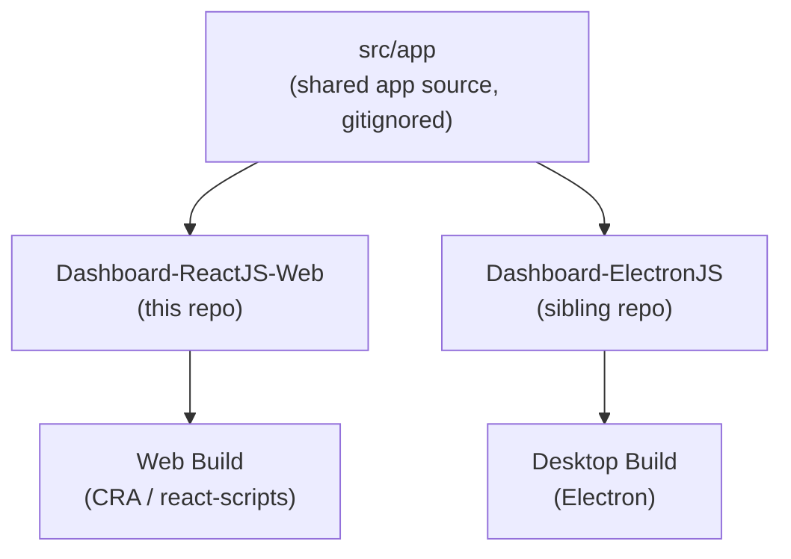

# Fuze Framework — Web

> React-based admin dashboard framework with built-in data tables, forms, and charts.


---

## What is Project Fuze?

Project Fuze is a component-based React framework designed for building administrator dashboards. It ships with a ready-to-use library of data tables, forms, and charts so you can focus on your product rather than scaffolding.

The framework is built around a **shared application core** (`src/app`) that is consumed by two separate shell repositories — one targeting the web, one targeting the desktop:



This repo is the **web shell**. It handles the CRA build pipeline, dependency management, and deployment. The actual UI components, routes, Redux store, and styles live inside `src/app` and are managed separately.

---

## Tech Stack

- **Core:** React 16, Redux + redux-thunk, Immutable.js, React Router v5
- **UI:** Material UI v4, Bootstrap 5, React Bootstrap, react-burger-menu
- **Data / Forms:** react-table v7, Formik + Yup, react-calendar, react-bootstrap-typeahead
- **Charts / Maps:** AmCharts 4 + amcharts4-geodata
- **HTTP:** Axios + axios-mock-adapter (mock API support for development)
- **Build:** Create React App (react-scripts 5), cross-env, concurrently

---

## Project Structure

```
Dashboard-ReactJS-Web/
├── public/
│   ├── index.html        # CRA HTML shell (title: "Fuze Project")
│   └── manifest.json     # PWA metadata
├── src/
│   ├── index.js          # Entry point — mounts <Provider store><App /></Provider>
│   ├── index.css         # Global base styles
│   ├── serviceWorker.js  # Optional CRA service worker helpers
│   └── app/              # Shared app source (gitignored — see note below)
│       ├── App.js
│       ├── Store.js
│       ├── App.css
│       └── AppOverride.css
├── deploy.sh             # Build + deploy script for production
└── package.json
```

> **Note:** `src/app` is listed in `.gitignore` because it is shared between this repo and the Electron sibling repo. It must be placed here manually before the app can run.

---

## Getting Started

### Prerequisites

- Node.js (v12–v16 recommended)
- npm

> If you run into memory issues during build, set the node option before running:
> ```bash
> nvm use 12.8 && export NODE_OPTIONS=--max_old_space_size=1024
> ```

### Setup

1. Clone this repository:
   ```bash
   git clone <repo-url>
   cd Dashboard-ReactJS-Web
   ```

2. Place the shared `src/app` source into the `src/` directory. This can be copied from the Electron sibling repo or from your shared source location.

3. Install dependencies:
   ```bash
   npm install
   ```

4. Start the development server:
   ```bash
   npm start
   ```

   Open [http://localhost:3000](http://localhost:3000) in your browser. The page reloads automatically on file changes.

---

## Available Scripts

| Script | Description |
|---|---|
| `npm start` | Start the development server at `localhost:3000` |
| `npm run build` | Build the app for production into the `build/` folder |
| `npm test` | Launch the test runner in interactive watch mode |
| `npm run eject` | Eject CRA config (irreversible — exposes Webpack, Babel, ESLint) |

---

## Deployment

The `deploy.sh` script handles building and deploying the app to a sibling web server directory.

### Usage

```bash
./deploy.sh -site reactjs           # Build and deploy
./deploy.sh -site reactjs -clean    # Pull latest src/app, then build and deploy
```

### What it does

1. **`-clean` (optional):** Runs `git fetch` + `git pull` inside `src/app/` to update the shared app source before building.
2. Runs `npm run build` to produce the production bundle.
3. Navigates to the sibling `reactjs.jovanjay.com/` directory.
4. Clears the existing site files and copies the new `build/*` contents in.

> The script must be executed from a directory named `reactjs`. The sibling deployment folder (`reactjs.jovanjay.com/`) is expected to exist at the same level.

---

## Related Repositories

| Repo | Description |
|---|---|
| **Dashboard-ReactJS-Web** (this repo) | Web shell — builds via Create React App |
| **Dashboard-ElectronJS** | Desktop shell — compiles the same `src/app` source with Electron |
